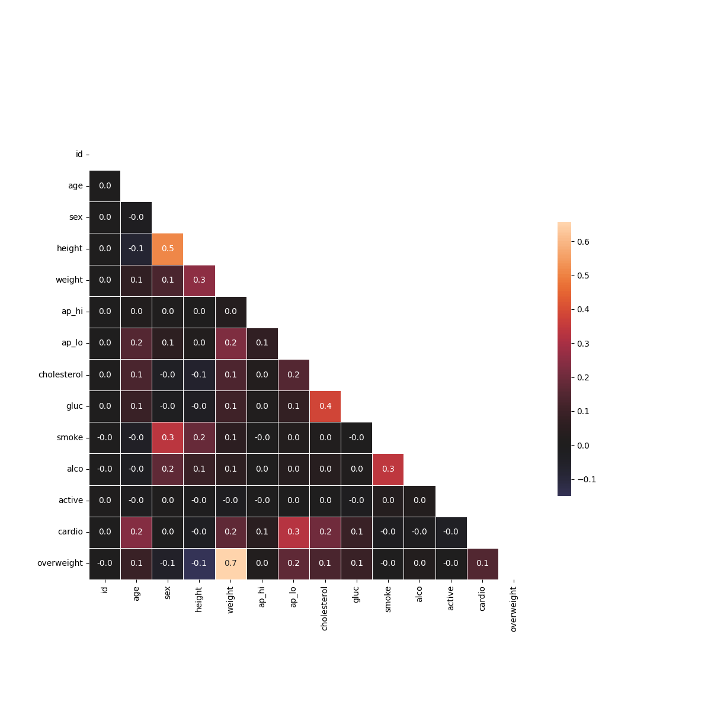

# Medical Data Visualizer

This project analyzes medical examination data to investigate the prevalence of cardiovascular disease based on various health metrics and lifestyle choices. The dataset is explored through data cleaning, feature engineering, and visualization using a categorical plot and a correlation matrix heatmap. This was completed as part of the freeCodeCamp "Data Analysis with Python" certification.

## Visualizations

### Categorical Plot by Health Metric
This plot shows the distribution of key health factors (Cholesterol, Glucose, Smoking, Alcohol Intake, Physical Activity, and being Overweight) for patients with and without cardiovascular disease.

### Correlation Matrix Heatmap
This heatmap reveals the correlation between different variables in the dataset after cleaning for incorrect or outlier data.

## Key Tasks Performed

- **Data Loading & Feature Engineering:** Loaded the dataset and added an `overweight` column based on BMI calculation.
- **Data Normalization:** Standardized categorical features like `cholesterol` and `gluc` into a binary format (0 for good, 1 for bad).
- **Categorical Visualization:** Created a faceted plot using Seaborn's `catplot` to show counts of health metrics against cardiovascular disease.
- **Data Cleaning for Correlation:** Filtered out erroneous data (e.g., incorrect blood pressure values, height/weight outliers) before creating the heatmap.
- **Correlation Heatmap:** Calculated and visualized the correlation matrix to identify relationships between variables.

## Technologies Used

- **Python**
- **Pandas:** For data loading, cleaning, and manipulation.
- **Matplotlib & Seaborn:** For creating the categorical plot and heatmap.
- **NumPy:** Used for creating the mask for the heatmap.

---
*This is one of five projects required to earn the freeCodeCamp Data Analysis with Python certification. You can view my certificate [here](https://www.freecodecamp.org/certification/angel_mainali/data-analysis-with-python-v7).*
